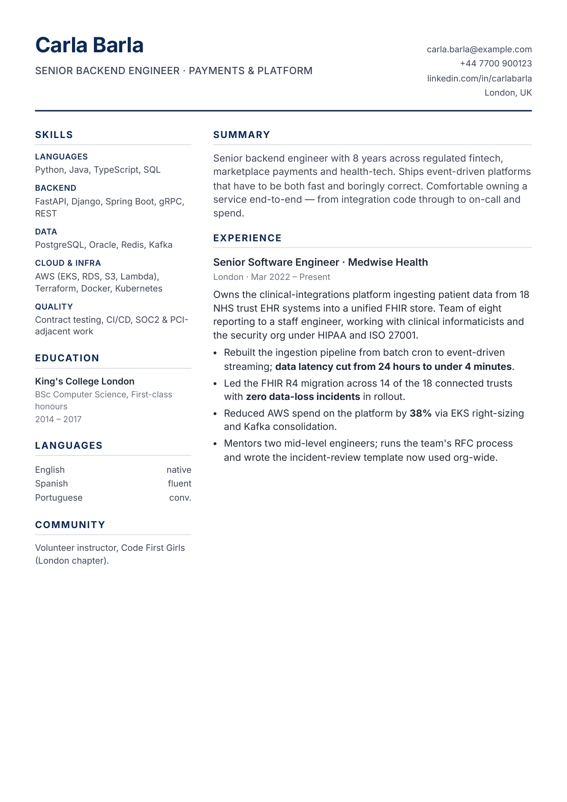
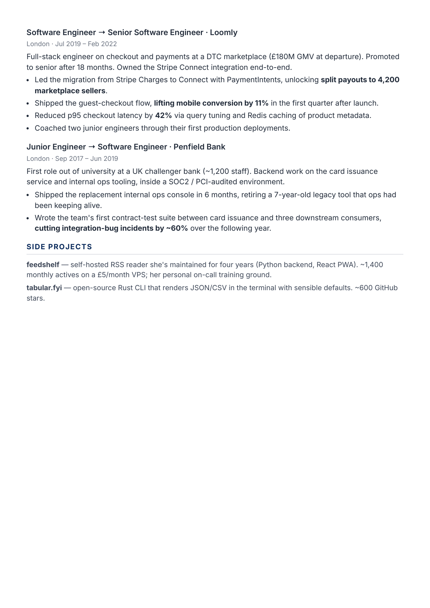
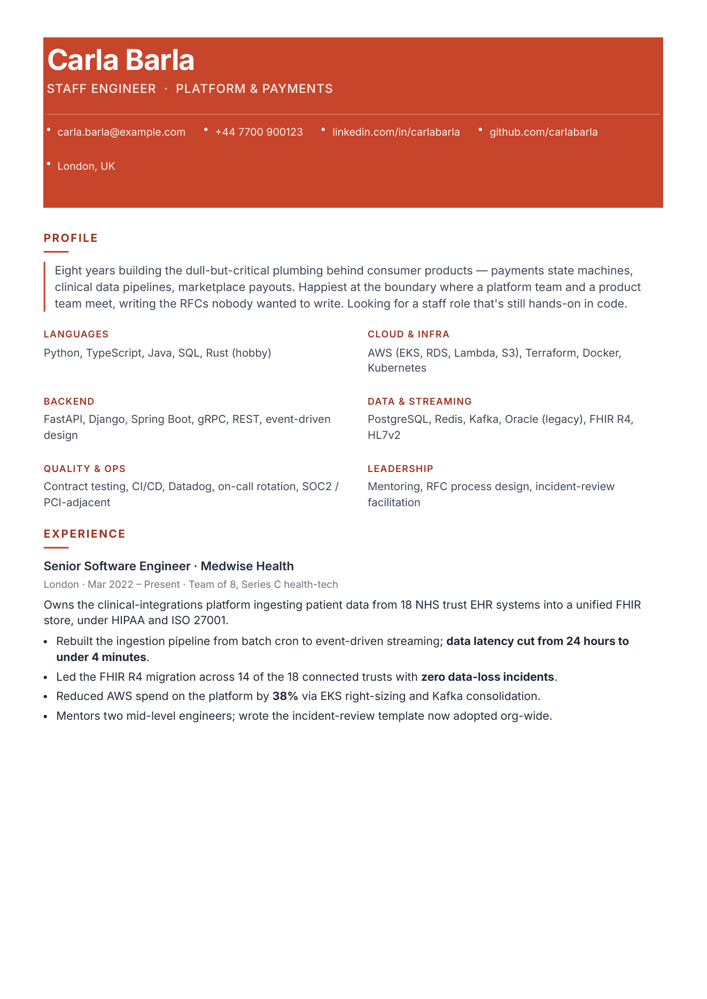
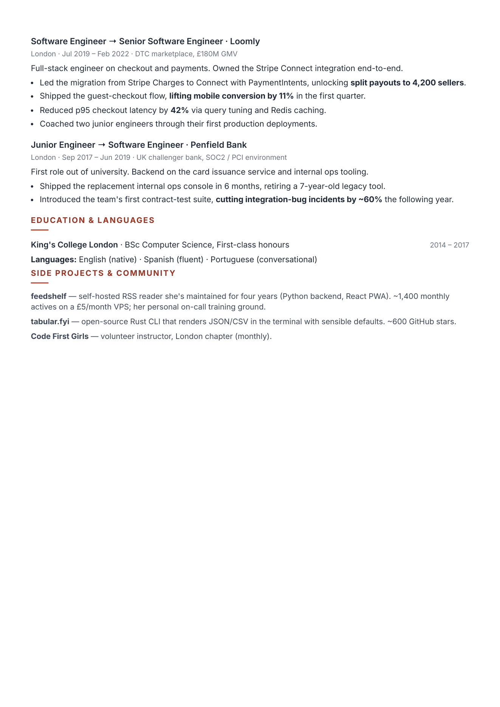
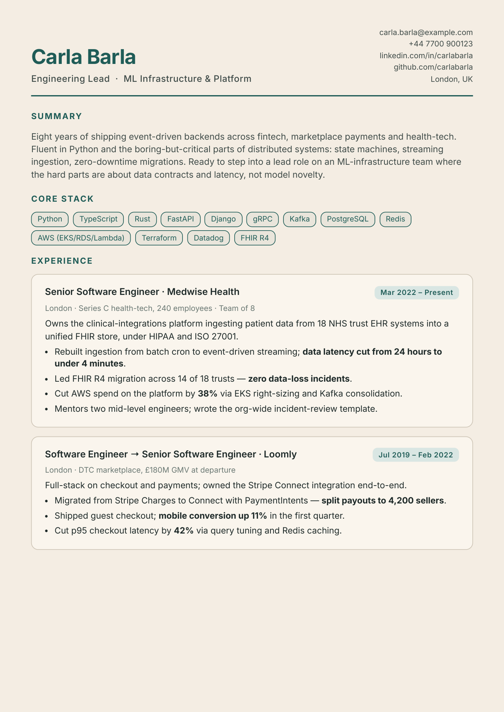
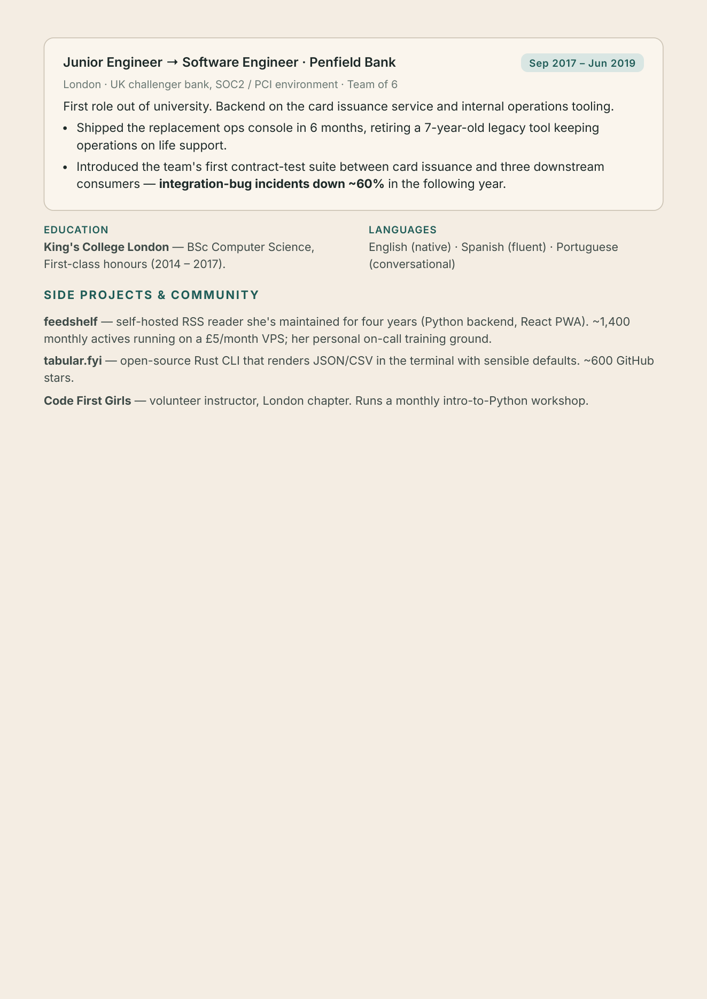
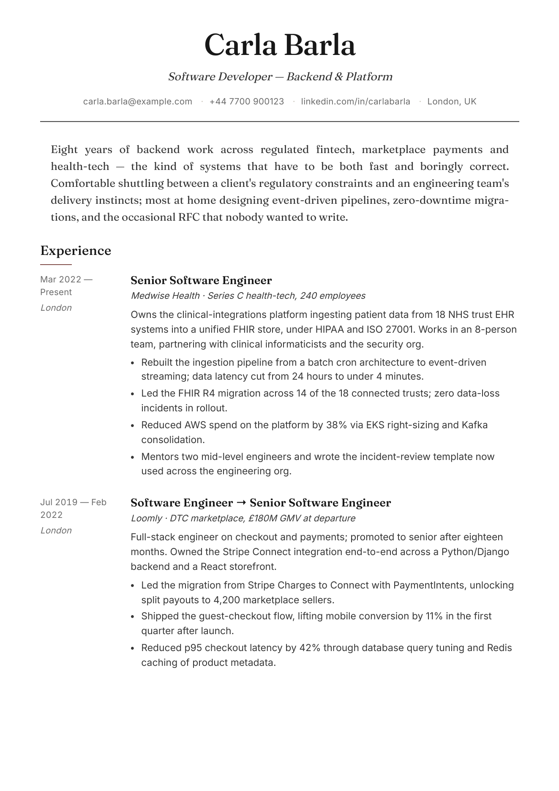
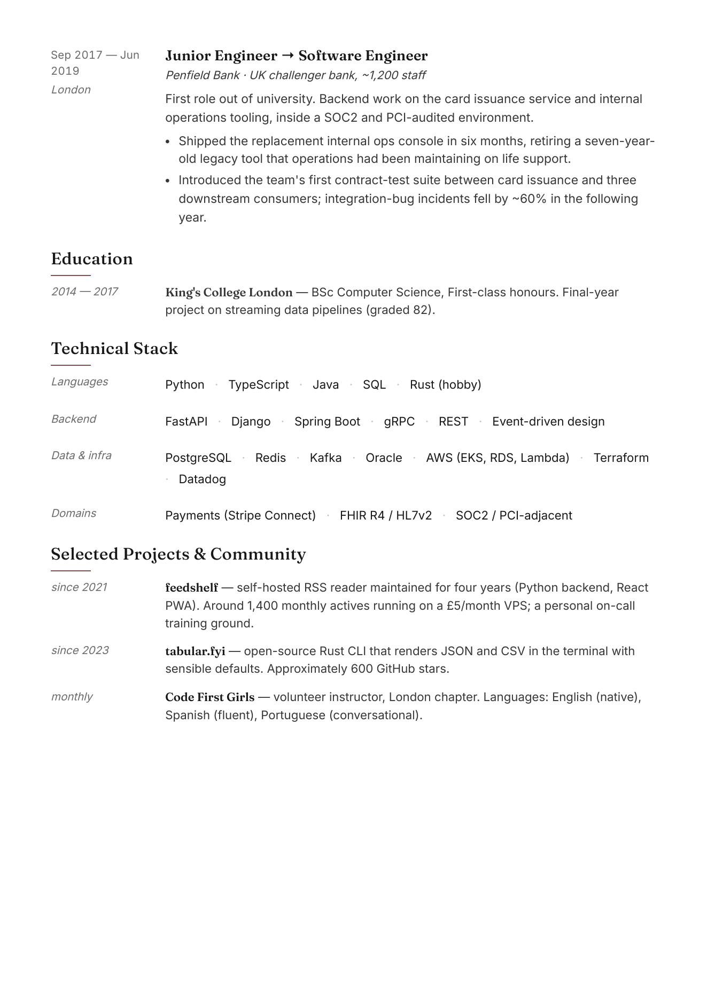

# job-2-cv

A [Claude Code](https://docs.anthropic.com/en/docs/claude-code) skill that turns a job-posting URL into a tailored, ATS-friendly, two-page PDF CV.

You paste a link to a role. Claude reads the job description, re-reads your long-form `context.md`, asks you 5–8 targeted gap questions, picks a visual layout that fits the company and seniority, generates the HTML, renders it to PDF via headless Chromium, and iterates on page breaks and whitespace until the quality gates pass.

The point isn't to automate applications. The point is to stop re-writing the same paragraph about the same job for the fifteenth time, and to stop sending the same generic CV into every ATS funnel.

---

## What it looks like

Four sample layouts for the same fictional developer, **Carla Barla**, tailored for four different kinds of company. Same source material — very different presentation.

### 1. Classic Left Sidebar — regulated fintech

A safe, ATS-friendly default. Skills / Education / Languages live in the left rail; the right column leads with the summary and the most recent role. Page 2 goes full-width.

<p align="center">
  
  
</p>

### 2. Header Band — brand-forward SaaS

Full-bleed coloured header strip carries the name, subtitle, and contact line. Below the band, a two-column skills block keeps keywords at the top of page 1 for skim-readers and ATS.

<p align="center">
  
  
</p>

### 3. Card Stack on tinted paper — modern tech / AI lab

Each role sits in its own softly bordered card on a warm cream paper. The coloured paper bleeds all the way to the page edges (no white border), which is trickier than it sounds in print CSS — the skill has explicit rules for it.

<p align="center">
  
  
</p>

### 4. Editorial / Serif Heritage — consultancy, advisory

Display serif headings, a timeline-style date rail on the left of each role, minimal colour, generous whitespace. Reads like a long-form profile; pairs well with advisory, consultancy, or writer-adjacent roles where restraint is a signal.

<p align="center">
  
  
</p>

> The skill ships with **ten** layout archetypes in total (see `references/layouts.md`). The four above are a sample; others include Right Sidebar, Single Column Traditional, Two-Column Balanced, Top Skill Bar, Timeline Dates, and Compact Monospace. Claude picks one per CV based on the role, company culture and how much content needs to fit — and commits to it, rather than blending them.

---

## Install

Drop the skill into your Claude Code skills directory:

```bash
git clone https://github.com/mrharel/claude-code-skills.git
mkdir -p ~/.claude/skills
cp -r claude-code-skills/job-2-cv ~/.claude/skills/
```

That's the whole install. Claude Code will auto-discover the skill the next time you start a session. The first time you invoke it, the skill will walk you through setting up a local Python venv with Playwright + Chromium (`scripts/setup.sh`, idempotent). You don't need anything else installed globally.

Requirements:

- **Claude Code** (or any harness that loads skills from `~/.claude/skills/`)
- **Python 3** on your `PATH` — `brew install python` on macOS is fine
- A working CV PDF you can point the skill at once, so it can extract your experience into `context.md`

---

## Use it

Pick a working directory for your job search (this is where `context.md` and all the per-role CV folders will live) and invoke the skill with a URL:

```
/job-2-cv https://jobs.acme.com/posting/1234
```

Or just drop the URL into a message — the skill's description is written so Claude will invoke it when you share a job link with any phrasing like *"make me a CV for this"*, *"tailor my resume to this role"*, *"apply to this"*.

### First run

On the very first run, there's no `context.md` in the directory. The skill will ask you for a path to your existing CV as a PDF. It will read the PDF, extract everything it can, and write a structured `context.md`.

`context.md` is a long-lived **raw capture** of you — employers, roles, tech environments, accomplishments, motivations, side projects. It is **not** a CV. It can be much longer than any single CV ever would be. The tailoring step is what decides what to include per role. (Template: `references/context-template.md`.)

### Every subsequent run

1. You paste a URL. Claude fetches the JD, does light web research on the company and role.
2. It re-reads `context.md` with the specific role in mind.
3. It asks you 5–8 targeted gap questions — things the JD emphasises that aren't clearly captured in your context. Your answers go back into `context.md` if they're durable.
4. It gives you an **honest fit assessment**. If the role is a stretch, it says so before building anything.
5. It recommends a **layout, colour palette and font**, with one-line reasoning. You can accept or override.
6. It creates `<Company>_<Role>/<Company>_<Role>.html`, renders it to PDF, reads the PDF back to visually inspect the output, and iterates until the quality gates pass (page count is exactly 2, no orphan pages, role blocks don't split, no empty sidebar on page 2, coloured backgrounds bleed to the edges, etc.).

Your working directory ends up looking like this:

```
my-job-search/
  context.md                    ← long-form you
  .venv/                        ← local Python + Playwright (one-time)
  ClearBank_Director_of_Engineering/
    ClearBank_Director_of_Engineering.html
    ClearBank_Director_of_Engineering.pdf
  Google_Cloud_OCE_Manager/
    Google_Cloud_OCE_Manager.html
    Google_Cloud_OCE_Manager.pdf
  ...
```

One folder per application. The `.html` sticks around so you can tweak it by hand and re-render.

---

## How it works

The skill runs in nine phases — the first two are cheap setup checks, phases 3–5 are the thinking work, and 6–9 are the build loop.

| Phase | What it does |
| --- | --- |
| 1. Context check | Looks for `context.md` in the cwd. If missing, seeds it from a CV PDF you supply. |
| 2. Setup check | Ensures `.venv/` has Playwright + Chromium. Runs `scripts/setup.sh` if not. |
| 3. Understand the role | Fetches the JD, does light web research on the company and typical interview questions for the role. |
| 4. Gaps & clarifying questions | Asks you 5–8 targeted questions to close gaps between the JD and `context.md`. Updates `context.md` with durable facts. |
| 5. Honest fit assessment | Tells you plainly whether the role is a good match, before spending time building. |
| 6. Design questions | Recommends one of 10 layout archetypes, a colour palette matched to the company, and a font pairing. |
| 7. Build the HTML | Generates a 2-page A4 HTML file, ATS-parseable, tailored to the JD — in the chosen archetype. |
| 8. Render & iterate | Renders to PDF via Playwright, reads the PDF back as an image, checks every quality gate, iterates until they pass. |
| 9. Deliver | Tells you the final path and summarises the tailoring decisions it made. |

The skill is deliberately **chatty at the start** (gap questions, fit assessment, design choices) and **silent during the render loop** — it just iterates until the CV is tight. You can always interrupt.

---

## Repository layout

```
job-2-cv/
  SKILL.md                      ← the skill definition Claude loads
  references/
    context-template.md         ← shape of the long-form context file
    layouts.md                  ← 10 layout archetypes with when-to-use guidance
    cv-rendering.md             ← CSS print rules, break control, quality gates
  scripts/
    setup.sh                    ← one-time venv + Playwright bootstrap
    render.py                   ← Playwright → PDF renderer
  docs/
    previews/                   ← the example images above
  README.md                     ← this file
```

The three files under `references/` are the load-bearing ones. `layouts.md` is what gives the skill aesthetic range; `cv-rendering.md` is what keeps the output from being an ugly HTML dump with white bars down the sides.

---

## Customising it

A few things you might want to tweak:

- **Add a layout of your own.** Add a new section in `references/layouts.md` with the archetype name, when-to-use guidance, an ASCII sketch and the key CSS knobs. Claude will start recommending it in Phase 6.
- **Lock the layout.** If you only ever want one design, trim `layouts.md` down to that archetype and Phase 6 becomes a rubber-stamp.
- **Stricter quality gates.** Add rules to the checklist at the end of `cv-rendering.md` — e.g., "no more than 6 bullet points per role", "page 1 must have at least 12mm of whitespace at the bottom". Claude will enforce them in Phase 8.
- **Different voice.** The opening paragraph of `SKILL.md` sets the persona ("experienced recruiter … London tech … natural, not AI-generated"). Rewrite it to match the hiring culture you're targeting.

---

## A note on AI-generated CVs

Both ATS systems and human recruiters have gotten good at spotting AI-generated CVs, and they punish them. The skill is tuned to push back against that: it asks you gap questions instead of inventing metrics, it writes in your voice from `context.md` rather than a boilerplate template, it runs an honest-fit check before it builds anything, and it de-emphasises rather than fabricates when there's a mismatch. It's a tool to save you time, not a way to launder a weak application.

---

## Licence

MIT — use it, fork it, tweak it, ship it.
